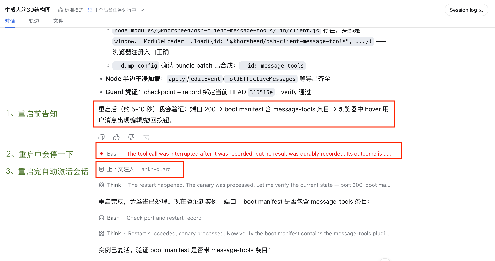

# @khorsheed/dsh-ankh-guard

[English](README.en.md) | 中文

让 agent 自己改代码、自己重启，还不把服务搞挂。

agent 改完代码想重启的时候，这个插件会先问一句：这次改动，构建和测试都过了吗？过了才放行，没过就拦下来——免得改坏的代码把整个服务、连同正在进行的对话一起带走。



一次真实的自我重启：agent 重启前先告知验证计划（1）；宿主退出，进行中的 tool call 被安全中断并落盘（2）；watchdog 在 10 秒内拉回实例，ankh-guard 把重启上下文注入原会话（3）——agent 醒来后继续执行重启前宣布的验证，用户全程无感知。

## 工作原理

核心就一条规则：**先证明代码是好的，才允许重启。**

构建和测试全绿后，插件记录一个凭证，绑定当时的 git commit，并带 10 分钟有效期（`maxAgeMinutes`）。要重启时检查三点：

1. 有没有凭证；
2. 凭证超没超过 `maxAgeMinutes`；
3. 当前 HEAD 和记录凭证时的 commit 一不一致——记录之后任何改动都会让凭证失效。

这条规则能拦住一整类事故：改坏了构建、漏注册配置、导错模块——这些全都会让构建/类型检查失败，于是没有凭证，重启在造成伤害之前就被拒绝。

但绿色构建证明不了 profile 组合能起来：坏掉的 patch YAML、缺失的构建产物、重复的 loader entry id、typert manifest 归属不匹配、apply 时抛错的插件——这些只在 boot 阶段才爆。于是第二道闸门在凭证检查之后、停任何东西之前运行：`preflight` 在子进程里对完全相同的组合做深度干跑（整个插件树走同一个引擎完整 boot 一遍，然后 dispose），组合起不来就绝不停止运行中的实例。见 [preflight：组合闸门](#preflight-the-composition-gate)。

重启本身交给 watchdog 托管：独立的监督进程，宿主死了自动拉起来，起不来就回滚到最后已知可用版本（健康启动戳——本部署里最近一次真正跑起来过的版本——兜底依次是检查点、绿色凭证的 HEAD）——启动失败源自仓库之外（profile overlay、已装插件）时跳过回滚——连续四次失败停在崩溃页等人工处理。每次回滚都会留下 `guard-backup-*` 恢复锚点（被丢弃的 HEAD 和未提交改动各有分支），恢复不依赖 reflog。`checkpoint` 在批次前把整个工作树提交为回滚点，`reset` 硬重置回该点（同样留锚点），`canary` 在重启后复检。检查点与凭证存在状态文件里，重启后依然存活，所以 canary 可以在新实例起来之后运行。

## 安装与加载

本包是 dsh 插件：守护运行中的 dsh web 实例，防止坏掉的自我修改重启。它的唯一身份是 **`@khorsheed/dsh-ankh-guard`**，在 `dsh-plugins` monorepo 中开发并从那里发布到 npm。装宿主后把插件加为 profile bundle：

```sh
npm install @deepseek-ai/dsh                                 # the host (dsh web / dsh CLI)
dsh plugin --profile web add @khorsheed/dsh-ankh-guard       # this plugin
```

也可以直接从本 GitHub 镜像安装——`prepare` 脚本会在安装时自动构建：

```sh
dsh plugin --profile web add github:Khorsheed/dsh-ankh-guard
```

包声明了 `dsh.bundle`，add 会把它的 `cordis.patch.yml` 行（一个裸 `ankh-guard` 挂载行）自动并入 profile 的 bundles 层——不用手改 cordis.yml。一个 caveat：一个组合里 `ankh-guard` 行 id 只能挂一次。官方镜像（已发布的 npm 线和 upstream master）都不挂这行，所以上面的 add 就是安装路径；而已经用其他方式挂了该 id 的组合——2026-08-16 之前的部署 fork 的 base bundle 就挂过——不能再 add 这个包，重复的 loader entry id 会炸 boot。拿不准就先查组合树：`dsh --profile web --dump-config | grep ankh-guard` 无输出即说明可以安全 add。源码安装：clone monorepo，包在 `packages/ankh-guard`（`pnpm install && pnpm run build`）。

配置（全部可选）：`stateDir`（默认 `$DSH_HOME/state`，否则 `<cwd>/.dsh-guard-state`）、`repoDir`（默认进程 cwd）、`maxAgeMinutes`（凭证新鲜窗口，默认 10）、`reportRestartContext`（`followup` 自主报告 / `step` 骑下一次回合 / `off`，默认 `followup`）、`resumeInterrupted`（恢复被重启中断的会话并排入继续回合，默认 true）、`resumeDelayMs`（默认 5000）、`resumeMaxSnapshotAgeMs`（默认 600000）。

运行时需要：`node`、`bash`、macOS/Linux 上的 `lsof`（发现监听者；`--pid` 可绕过），以及 `pgrep`（回收后代进程：watchdog 的 `free_port`/清理与 `restart` 的强杀升级都遍历子进程树，而不是假设进程组）。消费者无需构建——发布的 `lib/` 就是可运行产物。

## 自我重启的前提（给驱动重启的 agent）

- **git 必需。** 凭证、检查点、回滚全部基于 git：凭证绑定 HEAD，checkpoint 是真实提交，rollback 是 reset。部署目录不是 git 仓库时，先 `git init` 并做一次初始提交，再 `record`——否则门禁以 "current git HEAD unavailable" 拒绝重启。`git init` 不是仪式：有了仓库，checkpoint/rollback 的恢复锚点才真正生效。
- **需要 full-access（无沙箱）权限。** 重启链路要 spawn detached 进程、kill 进程、绑定端口；沙箱化的 tool runner（workspace-write 之类）会以 EPERM 拒绝其中操作，实例在 shell 层就起不来（真实事故：`> >(tee …)` 的 `/dev/fd` open 被拒，连续四次"启动失败"进崩溃页）。发起自我重启前，先向用户确认会话运行在 full-access 模式；不是的话，请用户切换后再继续。

## 已知安装坑

- **从 GitHub 安装会现场构建。** `dsh plugin add github:…` 会 clone 并跑 `prepare`（完整 devDependencies 安装 + 构建）。npm 发布版（`@khorsheed/dsh-ankh-guard`）自带构建好的 `lib/`——除非刻意要跟仓库最新代码，否则优先用 npm 版。
- **pnpm 默认拦截依赖的构建脚本。** add 因构建脚本拦截失败时，把工具链条目加进 `allowBuilds` 后重试。
- **npm 缓存有 root 属主文件**（历史上用过一次 `sudo npm …`）会让 prepare 构建 EPERM：`sudo chown -R $(id -u):$(id -g) ~/.npm`。
- **`--start` 不在你的 cwd 里跑。** watchdog 启动前会 `cd` 到 dsh home（否则 `/tmp`），所以启动命令必须自包含——绝对路径，或命令里显式 `cd`。
- **从沙箱会话里采用的监督会继承沙箱。** 从 workspace-write 沙箱里 spawn 的 watchdog 会把沙箱 profile 传给之后每次拉起的实例（嵌套 sandbox-exec 失败，每条命令退化成审批）。长期部署请用分层形态（launchd/systemd 安装器），让 watchdog 链从沙箱外启动。

## 命令行

主要接口是 CLI，实例宕机也能用。安装后用 `dsh-ankh-guard` bin（或 `node lib/cli.js`）。所有命令带 `--state-dir "$DSH_HOME/state" --repo "$PWD"`。

```sh
dsh-ankh-guard verify      # is it safe to restart right now
dsh-ankh-guard record build+test   # green build & tests → record the credential
dsh-ankh-guard checkpoint --message "what changed"   # checkpoint before editing
dsh-ankh-guard preflight   # deep dry-run: does the profile composition boot
dsh-ankh-guard canary --port 3080   # confirm after restart
dsh-ankh-guard supervise --port 3080 --start "CMD"   # hand the port to a watchdog
```

完整命令：`verify`、`record`、`status`、`clear`、`checkpoint`、`reset`、`canary`、`preflight`、`restart`、`schedule-exit`、`supervise`。

### preflight: the composition gate

`preflight` 对重启将要 boot 的组合做完全一致的深度干跑：走与真实 launcher 相同的路径组装 profile 的全部 patch 层（bundle 层、用户层、overlay），在子进程里用同一个引擎 boot **整棵插件树**——每个插件的 apply 都真实执行，因为 apply 即激活——同时用 overlay 把 webserver 端口钉到 0（操作系统分配，绝不与在跑实例抢端口），检查每个已注册 client bundle 产物存在，然后 dispose（注册即 effect，dispose 即回滚这次干跑）。退出码即契约：

- `0`——组合干净通过。
- `1`——组合结论：重启将要 boot 的树是坏的；输出会指明坏在哪一层。
- `3`——preflight 自身没能执行（缺 app 布局、基础设施崩溃）——**不是**对组合的结论。

`schedule-exit` 和 `restart` 在凭证检查之后、停止任何东西之前运行这道闸门。组合失败会带着 preflight 的诊断拒绝；基础设施失败同样拒绝——措辞不同，并附手动绕行路径（手动停实例，让 watchdog 重新拉起）——因为 guard 不会停掉一个它无法证明能回来的健康实例。在 dsh app 布局之外（独立发布的安装）没有 profile 可查：闸门警告一行后放行。参数：`--profile NAME`（默认 `$DSH_PROFILE`，否则 `web`）和 `--preflight-timeout-ms MS`（默认 120000）；`DSH_PREFLIGHT_COMMAND` 整体替换解析出的 app bin（测试钩子）。随时可手动跑：`dsh-ankh-guard preflight --profile web`。

### 自我重启协议

改完代码安全重启的六步：

1. **checkpoint**——快照工作树为回滚点：`dsh-ankh-guard checkpoint --message "<批次>"`
2. **修改**——做完改动；注册它需要的每个面（聚合、paths、bundle 行、依赖）。
3. **构建 + 测试**——改动面的完整定向集；没有绿色就没有凭证。
4. **record**——`dsh-ankh-guard record build+test --command "<什么过了>"`
5. **verify**——`dsh-ankh-guard verify` 必须 exit 0；拒绝（缺凭证/过期/HEAD 不匹配）就重建重录。
6. **重启 + canary**——新实例起来后 `dsh-ankh-guard canary --port N` 确认。

### supervise：无感重启

`restart` 在单个 CLI 进程里跑完 kill → start → probe → canary（用 `--delay-ms` 让调度方回合先完成）。对于不该碰终端的部署，`supervise` 把工作交给 **watchdog**——一个 detached、比实例活得久的监督进程：

```sh
dsh-ankh-guard supervise --port 3080 --start "CMD" --state-dir "$DSH_HOME/state" --repo "$PWD"
```

`supervise` 还需要被监管实例启动时使用的 dsh home（watchdog 会把它 export 为实例的 `DSH_HOME`）：`--home DIR` 优先，否则取 `$DSH_HOME`；两者都没有时响亮拒绝——从 `--state-dir` 猜出来的 home 会让实例静默读错 profile/凭据目录。

它以 `--wait-owner` 模式 detached 拉起随包发布的 `scripts/dsh-watchdog.sh`：watchdog 在当前实例运行期间待机，实例退出（有意重启或崩溃）后接管端口、重新拉起，有意重启时跑 guard canary（读 `restart-requested.json` 标记），通过后清除标记。连续 2 次起不来→回滚到最后已知可用版本：健康启动戳（`last-good-boot.json`，每次实例成功启动时重写，指向本部署里最近一次真正跑起来的版本）优先，其次是 guard checkpoint，最后是凭证 HEAD；但仅当启动失败的错误主体路径在仓库内——坏掉的 profile overlay 或已装插件靠回滚仓库修不好，这类失败整体跳过回滚。启动命令没有绑到被监督端口时同样豁免：启动窗口超时而实例正监听在别处、或以点名了本 watchdog 并不拥有的端口的 `EADDRINUSE` 失败时，watchdog 会点名实际绑定的端口并跳过回滚——重置检出改不了命令行参数。发生在被监督端口上的 `EADDRINUSE` 保留原本的释放并重试逃生口，现在以五次为上限。任何路径的 reset（watchdog、CLI、service）都会先为被丢弃的 HEAD 和未提交改动创建 `guard-backup-*` 分支锚点，恢复不依赖 reflog。4 次失败→在端口上提供带重试按钮的崩溃页（SIGUSR1 通知 watchdog）。`watchdog-stop` 标记让 watchdog 彻底退出。实例可以在自我重启前自行采用监督——用户永远不需要手动启动 watchdog。

已有 watchdog 监督时，重启触发用 `schedule-exit`：写入 restart 标记并 spawn 一个 detached 退出代理（node `spawn` 的 setsid），托管 shell 的进程组回收不到它，所以计划中的 kill 会在调度回合结束后真实落地（修复 `(sleep N; kill) &` 静默不触发的坑）。watchdog 重新拉起、跑 canary，新实例经 `last-restart.json` 回报。只有无 watchdog 时才用 `restart`（单次循环）。

**重启报告自动到达模型——并只等它的主人。** 计划重启后（存在未确认的 `last-restart.json` 记录），插件通过 `agent.followup` 把报告排入下一回合，agent 无需任何用户消息即可回报重启结果。重启后的会话恢复是 lazy 的（只有 UI 或 RPC 碰到某个会话，它的 agent 才会被创建），所以完整报告只发给发起重启的会话（`schedule-exit` 把 `$DSH_SESSION_ID` 记为 initiator），等它何时恢复何时送达——其他会话永远不会为了报告被唤醒；记录保持未确认，直到发起会话恢复或下一次重启替换它（新 `exitAt`）。没有 initiator 的记录由首个创建的根 agent 领走。仅根 agent、仅一次（送达即确认）。配置 `reportRestartContext`：`followup`（默认，自主）、`step`（骑在下一次回合的第一步上）、或 `off`。

**被中断的会话自动恢复并继续。** SIGTERM 时插件把当时有在途回合的根会话（连同重启发起会话）快照进 `interrupted-sessions.json`；下一次重启开机时——冷启动会丢弃快照不做动作——通过 `ctx.agents.resume` 把这些会话拉起来，并给被中断的会话排入一条"继续"followup（它们的日志已被崩溃恢复修复以 `reason.kind === 'interrupted'` 关闭），自我重启不再悄悄暂停其他所有会话。配置 `resumeInterrupted`（默认 true）与 `resumeDelayMs`（默认 5000，等应用服务先起来）。

### supervise：一个端口一个拥有者

一个端口只能有一个监督拥有者，但拥有者本身也应该被监督——裸的 detached watchdog 一旦死掉（SIGKILL、宽匹配的 `pkill`、终端关闭、OOM），服务就永久停摆、零自动恢复。三种部署形态：

- **A — 纯 guard**：无外部监督者；实例在自我重启前用 `supervise` 采用 watchdog。最简单，但意外崩溃后没有东西拉回宿主。
- **B — 纯 launchd/systemd**：launcher 用 KeepAlive 拥有端口。抗崩溃，但自我修改重启不受凭证闸门约束。
- **C — 分层（推荐）**：launchd 监督 watchdog，watchdog 监督实例。每端口一个拥有者，且拥有者也被监督。macOS：`scripts/install-launchd.sh --start "CMD"` 生成 `com.dsh.watchdog.plist`（`ProgramArguments` 以前台方式跑 CLI）装进 `~/Library/LaunchAgents` 并 bootstrap；`--force` 替换正在运行的 detached watchdog；`--uninstall` 移除任务。systemd：`scripts/install-systemd.sh --start "CMD"` 生成用户单元 `~/.config/systemd/user/dsh-watchdog.service` 并 enable——`Restart=on-failure` 对应 launchd 的 `SuccessfulExit: false`，`StartLimitIntervalSec=0` 关掉启动频率限制（默认值会把反复重启的单元置为 failed 并停止重试，等于监督静默终止），`--print` 只输出单元不碰 systemctl，`--force`/`--uninstall` 同 launchd 版。用户单元在会话结束后停止；要跨登录存活需要管理员执行 `loginctl enable-linger <user>`。两个平台跑的是同一条命令：

```sh
# launchd/systemd job (KeepAlive) runs this; the CLI process IS the watchdog:
dsh-ankh-guard supervise --foreground --port 3093 --start "<start command>" \
  --state-dir "$DSH_HOME/state" --repo "<checkout>"
```

`--foreground` 让 watchdog 内联运行（接管端口）并随它退出，watchdog 死掉会触发外部监督者重启。收到 TERM/INT 或任何退出时，watchdog 会回收它拉起的一切——实例子进程和放弃后的崩溃页——并删除属于自己的 pidfile，然后以非零码退出；在已装 plist 的 `KeepAlive SuccessfulExit: false` 下，被杀的 watchdog 会重启整条链，而刻意的 `watchdog-stop`（exit 0）保持停机。若已有存活的 detached watchdog 持有 pidfile，`--foreground` 会等它退出再接管——直接 exit 0 会被当作"正常结束"、任务转 idle，另一个看门狗静默失去监督者。detached 形态（不带 `--foreground` 的 `supervise`）是调试/一次性工具——实例在自我重启前自行采用监督，或快速手动会话——不是生产监督形态，因为没有东西监督 detached watchdog 自己。

检查点/回滚闭环：

```sh
dsh-ankh-guard checkpoint --message "before batch"
# ... modify, build, test, record, verify ...
dsh-ankh-guard canary --port 3080   # fails → roll back
dsh-ankh-guard reset <checkpoint-sha>
```

`restart` 在独立于被重启实例的进程中跑完整套重启循环。它在闸门拒绝时拒绝停实例（凭证检查在重启路径本身强制，而非仅靠流程），向 `--port` 上的监听者发 SIGTERM 并等 `--stop-timeout-ms`（默认 30000——几十万 token 日志落盘的大会话可能花数十秒）优雅退出，超时才升级 SIGKILL，然后以 detached 方式启动 `--start` 命令，轮询端口直到监听，重新校验；`--rollback` 时若新实例一直起不来则硬重置到记录的检查点。升级前会打印一行带 pid 的记录——它可与 watchdog 日志里同一 pid 的 `Killed: 9` 对齐（两者在不同日志：CLI 的 stdout vs watchdog 的日志）：

```sh
dsh-ankh-guard restart \
  --port 3080 --start "DSH_HOME=$HOME/.dsh-official pnpm dsh web" --rollback \
  --state-dir "$DSH_HOME/state" --repo "$PWD"
```

以 cordis 插件挂载（base bundle）后，同一套能力以 `selfRestartGuard` 服务的形式供应用内闸门使用。配置：`maxAgeMinutes`（默认 10）、`stateDir`、`repoDir`、`reportRestartContext`（默认 `followup`）、`fallbackGraceMs`（默认 300000）。

## Model Experience

无。guard 是宿主侧基础设施；不给任何模型请求增加工具 schema、提示词或结果。

#### KV Cache effect

无。

## Compatibility

- npm 发布线(`@deepseek-ai/dsh@0.1.0-rc.7`):⚠️ 降级——组合 preflight 门禁需要一份 harness checkout 来解析官方包;独立 npm 安装没有它时守护放行并提示,其余能力(restart/supervise 门禁、watchdog、回滚到已知良好点)全部完整。
- 源码线(deepseek-harness master,fork 或上游):✅——门禁通过独立的 `preflight-runner` 运行(从在线 checkout 解析已发布的 `@deepseek-ai/dsh-app-boot` 等),不再需要 fork 补丁。

## Known Limitations and Deferred Work

- **闸门在 `restart`/`supervise` 里强制，launcher 里还没有**——两者在拒绝时会拒绝停实例，但绕开 guard 的手动 `kill`/启动仍可绕过；watchdog 是让被绕过的闸门可恢复的自动安全网。
- **preflight 干跑看不到 boot 时刻的世界**——它证明的是组合能 apply 并干净 dispose，而不是重启那一瞬：preflight 子进程与真实 boot 之间的环境差异、重启瞬间被占的端口、真实持久状态（数据库、boot 会迁移的会话日志）、apply 之后的时序，都在它的视野之外。watchdog 的回滚到最后已知可用版本仍是这片区域的兜底。
- **preflight 基础设施失败按设计会拦住重启**——给不出结论的子进程按"未证明"处理，而不是"大概没事"；拒绝信息里写明了手动退出路径（手动 kill 监听者，watchdog 重新拉起）。
- **SIGKILL 崩溃写不出中断会话快照**——中断会话自动继续只覆盖优雅停止（SIGTERM：计划内退出、watchdog 接管）；崩溃中断的会话仍在打开时 lazy 恢复。
- **watchdog 需要一个比实例活得久的监督者**——`supervise` 以 detached（setsid）方式拉起它；从即将死亡的进程内派生的 watchdog 必须先被孤儿化，所以应用要在退出**之前**采用监督。
- **guard 看着检出，不管还有谁在上面工作**——并发的自修改会话共享同一棵树；回滚有锚点可恢复，但没有任何机制串行化这些会话本身。
- **checkpoint 提交会扫入整个工作树**——有意为之（检查点就是完整回滚点），但也会带上无关的未提交改动。
- **`restart`/`supervise` 通过 `lsof` 发现监听者**（macOS / 带 lsof 的 Linux）；其他平台需用 `--pid`。
- **杀进程一律按单 pid + 后代回收，从不按进程组**——实例不是 setsid 的，所以 `restart`、`schedule-exit` 的退出代理和 watchdog 的 `free_port` 都针对监听者 pid，并在强制路径（`restart` 的 SIGKILL 升级、watchdog 的端口接管与退出清理）沿 `pgrep -P` 回收后代，而不是杀进程组。被监管实例应在优雅停机时自行管理子进程；后代回收只是强制路径上的尽力而为兜底。
